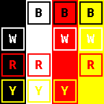

# Pervasive Displays Library Suite - Basic Edition - Black-White-Red-Yellow

      

The Pervasive Displays Library Suite is specifically designed for the [Pervasive Displays](https://www.pervasivedisplays.com) e-paper screens and EXT3 extension board.

The **PDLS_EXT3_Basic_BWRY** provides a high-level interface to drive the e-paper black-white-red-yellow colour screens with global update:

+ [EPD Extension Kit Gen 3 (EXT3 or EXT3-1)](https://www.pervasivedisplays.com/product/epd-extension-kit-gen-3-EXT3/); 
+ iTC [black-white-red-yellow colour](https://www.pervasivedisplays.com/products/?_sft_product_colour=black-white-red-yellow) screens (film `QS`).

Please refer to [PDLS_EXT3_Basic](https://github.com/rei-vilo/PDLS_EXT3_Basic/issues) for reporting issues and contributing pull requests.

Basic colours | Ten colours | Contrasts 
--- | --- | ---
 |  | 

*By combining the four **basic colours**, black, white, red and yellow, six other colours are obtained: grey, light red, dark red, light yellow, dark yellow and orange, totalling **ten colours**, with high **contrasts** for high-impact messages.*

## Features

+ Global update
+ Graphics routines
+ Text routines
+ Extended colours
+ Four extended fonts with double-sized variants

## Documentation and support

+ [Wiki](https://docs.pervasivedisplays.com/) 
+ [User guide](https://pdls.pervasivedisplays.com/userguide/index.html) with commented examples
+ [Reference manual](https://rei-vilo.github.io/PDLS_EXT3_Basic_Documentation/index.html) 

+ For support, please refer to [PDLS_EXT3_Basic_Global](https://github.com/rei-vilo/PDLS_EXT3_Basic_Global/issues) for reporting issues and contributing pull requests.

## Installation

Software

+ [Installing Additional Arduino Libraries](https://www.arduino.cc/en/guide/libraries)

    + Using the Library Manager
    + Importing a `.zip` Library

Hardware

* [Connecting the Pervasive Displays e-Paper EPD Extension Kit Gen 3](https://embeddedcomputing.weebly.com/connecting-the-e-paper-epd-extension-kit-gen-3.html)

## Configuration

Software

* Arduino SDK
* SPI library

Hardware

* Pervasive Displays [EPD Extension Kit Gen 3 (EXT3 or EXT3-1)](https://www.pervasivedisplays.com/product/epd-extension-kit-gen-3-EXT3/)
* Pervasive Displays iTC [black-white-red-yellow colour screens](https://www.pervasivedisplays.com/products/?_sft_product_colour=black-white-red-yellow)

## Licence

**Copyright** &copy; Rei Vilo, 2010-2024

For exclusive use with Pervasive Displays screens

**Licence** [Attribution-ShareAlike 4.0 International (CC BY-SA 4.0)](./LICENCE.md)

**Portions** &copy; Pervasive Displays, 2010-2024
